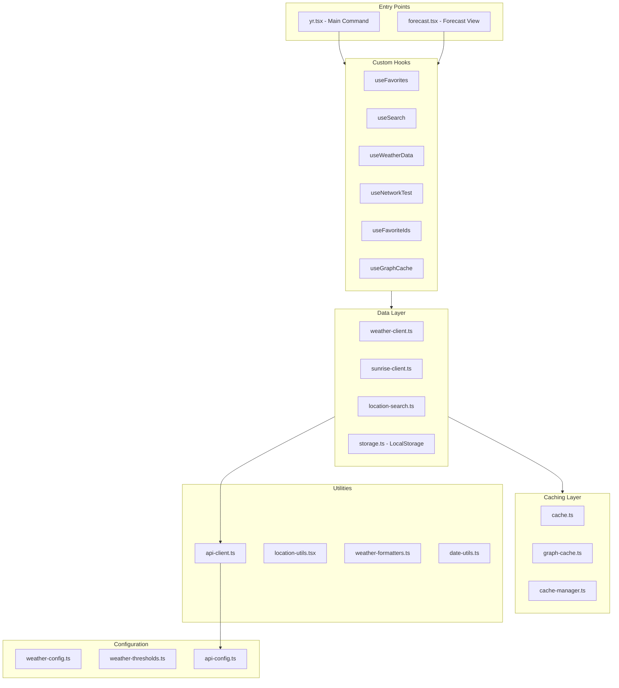

# Yr Weather Forecast (Raycast Extension) — Consolidated Code Review

Date: 2026-01-21

This document consolidates three separate reviews into a single **DRY**, **non-lossy** review. It preserves all valuable observations and recommendations while removing duplication. Any contradictory statements are recorded under **TODO: verify contradictions** (not silently resolved).

Sources:
- `docs/composer-review.md`
- `docs/gpt-review.md`
- `docs/opus-review.md`

---

## Scope (what was reviewed)

Primary entry points and core modules called out across reviews:

- `src/yr.tsx` (main command)
- `src/forecast.tsx` (forecast/detail view)
- API clients: `src/weather-client.ts`, `src/sunrise-client.ts`, `src/location-search.ts`
- Caching: `src/cache.ts`, `src/graph-cache.ts`, `src/utils/cache-manager.ts`
- Persistence/matching: `src/storage.ts`
- Hooks: `src/hooks/*` (search, favorites, network tests, graph cache)
- Utilities: `src/utils/*` (formatters, date utils, action panel builders, api-client)
- Config: `src/config/weather-config.ts`, `src/config/weather-thresholds.ts`, `src/utils/api-config.ts`

---

## Architecture analysis

---

## What’s strong (high-signal positives)

- **Separation of concerns (mostly)**:
  - Distinct hooks for search/favorites/weather/network testing.
  - Utilities grouped by domain (formatters, date utils, action panels).
  - Separate API clients (`weather-client.ts`, `sunrise-client.ts`, `location-search.ts`).

- **Raycast ergonomics & UX features**:
  - Fast list UI in `src/yr.tsx`.
  - Forecast view lazy-loads heavier graph code via `src/components/lazy-forecast.tsx`.
  - Rich features mentioned across reviews: natural-language date queries (e.g. “Oslo friday”, “tomorrow”, day-of-month queries), favorites, multiple modes/views (48h detailed, 9-day summary, data table), graphs with sunrise/sunset indicators, welcome/first-run messaging, background loading indicators, connectivity status, and retry actions on errors.
  - Keyboard shortcuts and good ActionPanel usage are explicitly called out as strong.
  - “Small UX touches” called out: helpful error messages, retry actions, and a character counter for minimum search length.

- **Config/threshold foundation**:
  - Centralized config (`src/config/weather-config.ts`) and thresholds (`src/config/weather-thresholds.ts`) reduce scattered tuning constants (though some magic numbers remain; see below).

- **Performance-minded design**:
  - Lazy loading to defer D3/graph costs.
  - Caching exists with multiple layers (details and issues below).
  - Search debouncing is present (noted as ~500ms).
  - Network testing is described as being throttled/guarded to avoid noisy checks.
  - Lazy graph loading is described as using Suspense + a fallback UI, plus a “preload on hover” concept (preloader hook) to reduce perceived latency.

- **Internationalization / parsing capability**:
  - Date parsing supports Norwegian/English constructs (noted in `src/query-intent.ts`).

- **Modern TypeScript/React baseline (mostly)**:
  - Strict TypeScript usage and broadly good null/undefined handling are called out as strengths.
  - Functional components + hooks are used throughout; useMemo/memoization exists in places.

---

## Key risks / Critical issues (prioritize for correctness & user trust)

### P0 — Location identity & favorites correctness

**Problem**: Location identity appears inconsistent across storage/caching/UI:
- Stable ID from Nominatim (`place_id`) when available.
- Derived IDs (e.g. rounded `lat.toFixed(3),lon.toFixed(3)` used in at least one path).
- Heuristic matching in `src/storage.ts` (“same location” may use ID OR proximity + name similarity).

**User-visible risk**:
- Duplicate favorites for the same place (stored under different IDs).
- Incorrect favorite removal/update (nearby-but-distinct places collapsing).
- Cache key inconsistencies across layers (weather/sun/graph caches not aligned).

**Recommendation**:
- Define and use a single canonical `locationKey` function everywhere (favorites IDs, weather/sun cache keys, graph cache keys, UI keys).
- If proximity/name-similarity matching is kept, constrain it so it cannot delete/merge multiple distinct favorites without explicit confirmation/logic.

### P0 — Timezone/date correctness

**Problem**: Day filtering and coverage reporting likely contain timezone bugs:
- `filterToDate()` in `src/weather-utils.ts` does manual offset math that may be incorrect for UTC ISO timestamps.
- `analyzeDataCoverage()` in `src/utils/weather-summary-builder.ts` adjusts offsets in a suspicious direction, likely misreporting coverage windows in many locales.

**Recommendation**:
- Re-implement day filtering using a single coherent strategy (either consistently treat all times as UTC, or convert to local-time boundaries without ad-hoc offset math).
- Re-check `analyzeDataCoverage()` to compute user-local coverage windows correctly.

### P0/P1 — “Clear cache” semantics are not trustworthy

**Problem**: Cache clearing is fragmented and may be non-functional for some layers.
- Caching is split between `src/cache.ts` (LocalStorage TTL), `src/utils/cache-manager.ts` (memory + persistent wrapper), and `src/graph-cache.ts` (version/hash keying).
- `src/graph-cache.ts` clearing/invalidation functions are described as logging/no-op rather than actually removing persisted entries.
- “Refresh & Clear Cache” paths appear in multiple UI locations, increasing the chance semantics diverge.

**Recommendation**:
- Either implement **real persistent cache clearing** (including tracking keys, and clearing weather + sun + graph caches) or rename UI/actions so they don’t claim to clear what they can’t.
- Consolidate cache clearing into a single place (e.g. a `useCacheManagement` hook or a small cache service module).

### P1 — Debug logging leaks (console.* in production)

**Problem**: Multiple modules use `console.*` directly, bypassing the preference-controlled `DebugLogger` (`src/utils/debug-utils.ts`), including at least:
- `src/storage.ts`
- `src/query-intent.ts`
- `src/graph-utils.ts`
- `src/hooks/useGraphCache.ts`
- `src/utils/bundle-analyzer.ts`

**Recommendation**:
- Route all logs through `DebugLogger` (and have it handle “debug mode enabled?” internally).
- Treat bundle analysis logs as dev-only or gate them behind the same preference.

---

## Caching & performance (findings + DRY opportunities)

### Current caching strategy (as described) vs. observed semantics

The reviews describe a caching approach with:
- Multi-layer caching (memory + persistent storage wrapper in `src/utils/cache-manager.ts` plus direct TTL caching elsewhere).
- TTLs called out explicitly: ~30 minutes for weather and ~6 hours for sunrise/sunset.
- Favorite graph “pre-warming” to improve perceived performance.

However, cache-clearing semantics are called into question (see “Clear cache semantics” above and TODO contradictions).

### Cache key generation duplication / inconsistency

**Finding**: Similar cache-key patterns appear in multiple files (weather/sun/graph caches). A `CacheKeyGenerator` exists in `src/utils/cache-manager.ts` but is not used consistently.

**Recommendation**:
- Centralize cache key generation (and align it with the canonical `locationKey` strategy).

### Caching architecture is split (pick one direction)

**Finding**: The codebase currently carries multiple cache abstractions:
- `src/cache.ts` (persistent TTL, Raycast LocalStorage)
- `src/utils/cache-manager.ts` (memory + persistent wrapper)
- `src/graph-cache.ts` (graph-specific keying/cleanup)

**Recommendation (choose one)**:
- Option A: Keep `src/cache.ts` as the single cache layer and delete/migrate `CacheManager`.
- Option B: Migrate all call sites to `CacheManager` and stop calling `getCached/setCached` directly.

### Potentially wasteful work / performance smells

- `useFavoriteIds` calls `isFavorite()` per search result (LocalStorage read/parse repeatedly), creating avoidable O(n*m) behavior.
  - Recommendation: load favorites once, build a lookup map, and use O(1) membership checks.
- Graph generation in `src/forecast.tsx` depends on many values; expensive regeneration may trigger more often than necessary.
  - Recommendation: memoize intermediate values, split effects, and/or throttle.
- Favorites “prewarm graph” uses a single timeseries point but may label it like a 48h graph (mismatch with user expectations of a “forecast graph”).
- Network test depends on `httpbin.org` (`src/hooks/useNetworkTest.ts`), increasing false negatives and adding an external dependency surface.
  - Recommendation: prefer testing against the same services the extension actually needs (MET + Nominatim), or make `httpbin` optional.

---

## Maintainability & DRY (where complexity is accumulating)

### Large components with mixed responsibilities

- `src/yr.tsx` is described as handling search, favorites, network testing, graph caching, welcome message, cache clearing, and UI rendering.
  - Recommendation: introduce an orchestration hook (e.g. `useMainView`) to coordinate concerns.

- `src/forecast.tsx` is described as very large and handling:
  - sunrise/sunset fetching and retry/timeout logic,
  - graph generation and caching,
  - multiple interdependent UI states.
  - Recommendation: extract:
    - `useSunriseSunset` for sunrise/sunset fetch + retry + timeout
    - `useGraphGenerator` for graph generation/caching
    - Consider `useReducer` for interdependent state (mode/view/favorite/sunByDate/graphCache).

### Duplicated or inconsistent patterns

- Cache clearing logic appears scattered across multiple components (multiple “refresh & clear cache” patterns).
  - Recommendation: a single cache management hook/service.

- Weather client duplication:
  - Nearly identical `getWeather`/`getWeatherWithMetadata` and `getForecast`/`getForecastWithMetadata` functions differ mainly by metadata inclusion.
  - Recommendation: unify via an `includeMetadata` parameter or a single internal implementation.

- `weather-client.ts` duplicates fetch/caching logic instead of using `src/utils/api-client.ts` (an existing abstraction).
  - Recommendation: either migrate `weather-client.ts` to use `ApiClient`, or remove `ApiClient` if it’s not intended to be used.

- Deprecated `formatTemp` exists both in `src/weather-utils.ts` (deprecated wrapper) and `src/utils/weather-formatters.ts` (current), and the deprecated version is still used in some places.
  - Recommendation: remove the deprecated version and update call sites/imports.

- Function declaration style is mixed (named exports as function declarations vs arrow functions).
  - Recommendation: standardize (reviews suggest preferring function declarations for named exports).

### Effects and lifecycle concerns

- Duplicate near-identical effects in `src/yr.tsx` refresh favorite IDs based on slightly different dependency sets, likely causing redundant refreshes.
  - Recommendation: merge into a single effect with the correct dependencies.

- Potential interval recreation / leak pattern:
  - A cleanup interval in `src/yr.tsx` depends on a `graphCache` object from a hook; if that object identity changes each render, the interval may be recreated frequently.
  - Recommendation: ensure stable references (memoize or expose stable methods), or restructure the effect.

---

## Error handling, reliability, and type safety

### Error handling patterns to improve

- Silent failures in favorites/weather preloading (`catch {}` returning undefined without logging).
  - Recommendation: log via `DebugLogger.warn` (even if user-facing toast is suppressed).

- Broad `catch` blocks (with no type guards) can hide unexpected errors.
  - Recommendation: narrow expected error types and re-throw unexpected ones.

### Network handling gaps

- Sunrise/sunset client has retry logic; main weather client is described as failing immediately on error.
  - Recommendation: implement consistent retry logic across clients (prefer exponential backoff).

- No request cancellation via `AbortController`.
  - Recommendation: add `AbortSignal` support for fetch calls to avoid wasted work when users navigate quickly.

- Timeout handling exists in at least one place (10s is explicitly called out), but not all long-running async work appears to share the same standardized mechanism.
  - Recommendation: standardize timeouts/retry/cancel semantics via shared helpers or a single client abstraction.

### Runtime validation at API boundaries

- Type assertions like `as unknown` then `as TimeseriesEntry` bypass real validation.
  - Recommendation: add runtime validation (Zod/io-ts) or explicit type guards for critical API payloads.

---

## Raycast-specific considerations

- **Missing error boundaries**:
  - A crash in graph generation or forecast view could crash the entire extension.
  - Recommendation: add an ErrorBoundary around forecast and/or major views.

- **Preferences housekeeping**:
  - Several preferences are defined in `package.json` (e.g. screen reader mode, verbose descriptions, announcements).
  - There is a conflict about whether these preferences are actually used in `src/` (see TODO section).
  - Recommendation: either implement fully or remove to avoid misleading UX.
  - Preference keys explicitly called out as defined but possibly unused:
    - `enableScreenReaderMode`
    - `verboseDescriptions`
    - `announceLoadingStates`
    - `announceErrors`
    - `announceWeatherChanges`

- **Graph theme compatibility**:
  - Hardcoded graph background color is reported as `"white"` in thresholds, which would ignore dark mode.
  - Recommendation: add theme detection and dark-mode-aware graph colors.

- **Toast spam**:
  - Prevent repeated “date query detected” toasts for the same search session/query (called out in `src/hooks/useSearch.ts`).

---

## Testing

Finding: Jest config exists but no tests were observed in the repo at the time of review.

Suggested initial test targets:
- Query intent parsing: `src/query-intent.ts`
- Location matching/fuzzy logic: `src/storage.ts`
- Weather transformations/formatters
- Cache manager operations / cache key generation
- Hooks (via React Testing Library where applicable)

---

## Security & privacy

- Strengths:
  - No authentication tokens needed.
  - No explicit personal data collection described; storage is local.
  - Open-source transparency.
- Consideration:
  - API calls expose searched locations to third-party services (OpenStreetMap/Nominatim + MET). Consider a clear note in README (partially addressed per review).

---

## Recommendations (prioritized)

### P0 — Correctness first

1. **Unify location identity** (canonical `locationKey` used consistently for favorites + all caches + UI keys).
2. **Fix timezone/date correctness** (rework day filtering + coverage reporting with a coherent time strategy).
3. **Make “clear cache” truthful** (implement real clearing across layers or rename UI/actions).

### P1 — Reliability & dev ergonomics

4. **Route all logging through `DebugLogger`** (remove `console.*` leaks; gate dev-only logs).
5. **Add request cancellation** (AbortController).
6. **Add consistent retry logic** across API clients (not just sunrise/sunset).
7. **Add error boundaries** around major views.

### P2 — Performance + DRY cleanup

8. **Fix `useFavoriteIds` performance** (favorites map/lookup).
9. **Consolidate caching architecture** (choose `cache.ts` OR `CacheManager` direction; reduce mental overhead).
10. **Refactor `weather-client.ts` + ApiClient duplication** (migrate to `ApiClient` or delete it).
11. **Reduce duplication in weather-fetch functions** (metadata variants, key generation).
12. **Extract complex logic from `forecast.tsx`** (`useGraphGenerator`, `useSunriseSunset`, useReducer where appropriate).
13. **Clean up duplicated/deprecated helpers** (e.g. `formatTemp`).

### P3 — UX polish + housekeeping

14. **Preferences cleanup** (implement unused preferences or remove them).
15. **Reduce third-party network-test dependency** (avoid `httpbin` or make optional).
16. **Theme/dark-mode graph compatibility** (remove hardcoded white background; adopt theme-aware palette).
17. **Documentation** (architecture/data-flow diagram, hook APIs, contributing guidelines, API rate limiting info).
18. **Optional**: explore Raycast AI integration for natural-language queries.

---

## Suggested implementation order (small PRs)

- PR 1: Logging cleanup (`console.*` → `DebugLogger.*`), ensure “Debug Mode” truly controls output.
- PR 2: `useFavoriteIds` performance fix (single-pass favorites map).
- PR 3: Identity unification (canonical location key + favorite ID strategy).
- PR 4: Date/time correctness fixes (filtering + coverage reporting).
- PR 5: Cache semantics cleanup (make “clear cache” real or rename/adjust).
- PR 6: Preferences cleanup (implement or remove unused preferences).

---

## TODO: verify contradictions

Record and verify these conflicts before acting on them:

1. **Preferences usage**:
   - One review describes accessibility/announcement preferences (screen reader mode, verbose descriptions, announce loading/errors/changes) as implemented features.
   - Another review claims the corresponding preferences defined in `package.json` are **not referenced in `src/` at all**.
   - TODO: verify actual usage by searching `src/` for preference keys and confirming runtime behavior.

2. **Cache clearing behavior**:
   - One review describes an “intelligent caching strategy” with invalidation semantics.
   - Another review states graph-cache clearing/invalidation functions are effectively **no-ops** (log-only) and thus “clear cache” actions may not truly clear persisted entries.
   - TODO: verify which caches are actually cleared by each “clear cache” flow and whether LocalStorage keys are removed.

---

## Minor issues / housekeeping (lower priority but concrete)

These were called out explicitly and are useful to track, but are generally not P0:

- **Non-functional graph cache clearing (example)**:
  - Reported that `clearAllGraphCache`, `clearLocationGraphCache`, `invalidateLocationGraphCache`, `cleanupOldGraphCache` mostly log and do not clear persisted entries.

- **Hardcoded limits / magic numbers**:
  - 10s timeout value is explicitly mentioned.
  - A “400 day search limit” is explicitly mentioned in `src/query-intent.ts`.
  - A small 50ms setTimeout used during initialization is explicitly mentioned.
  - Recommendation: move timing/limits into config (`weather-thresholds.ts`) where appropriate.

- **Inconsistent state naming**:
  - Examples called out: `favoritesLoaded` vs `isInitialLoad`, and `weatherDataInitialized` vs `isInitialLoad`.

- **Unused hook return value**:
  - `useForecastPreloader()` is reported as called in `src/yr.tsx` but its return value is never used.

- **Comment quality inconsistency**:
  - Some areas are well documented; other comments are described as obvious or uneven.

---

## Overall assessment (subjective)

- The baseline architecture is described as solid with thoughtful UX and performance work (lazy graphs, caching, utilities/hooks).
- The most important technical debt areas converge on correctness (identity + timezones) and trust (cache clearing semantics + uncontrolled logging).
- Reported quality ratings include “B+ (Very Good)” and “7/10 (well-structured with room for polish)”; these are subjective but directionally consistent.

## Provenance

This document is a DRY consolidation of:
- `docs/composer-review.md`
- `docs/gpt-review.md`
- `docs/opus-review.md`

